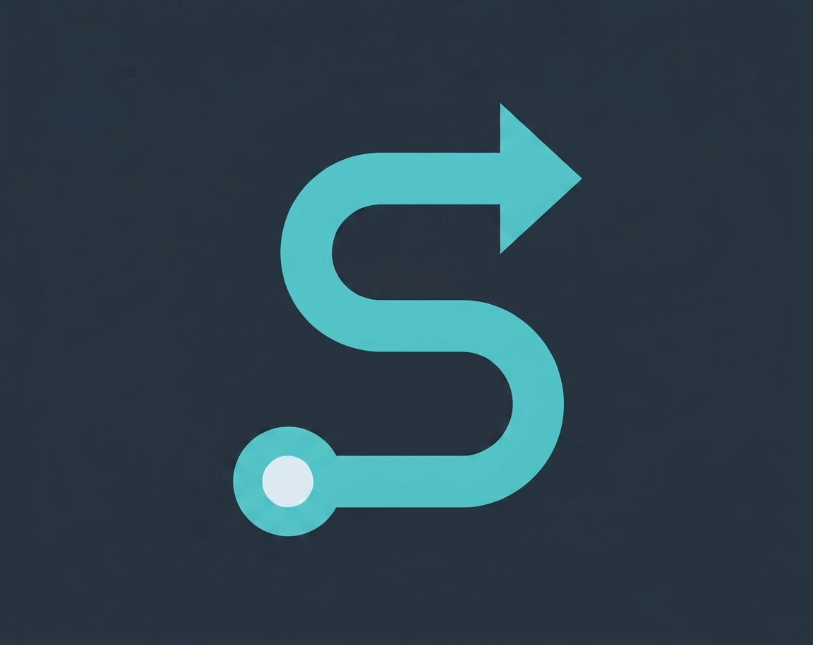

# SpecFlow

<p align="center">
  
</p>

SpecFlow 是一套**引擎驱动**的 **SDD（Spec-Driven Development）** AI Coding 流程，面向大型团队的日常需求交付。

- **Engine decides**：`specflow-engine` 读取 `ai-docs`、`.temp/gates.json` 与运行态，判断当前阶段、门禁和下一步动作。
- **Harness executes**：Skills、Agents、Hooks 负责对话、写文档、编码、验收和归档，不自行越过引擎决策。
- **Docs first**：从 `specify.md` 到 `plan.md`，再到 Roadmap Group 实现、QA 证据和归档，规格与契约先于代码。
- **Change is separate**：需求、接口、字段、验收口径变化先走文档同步，再继续实现，避免边写边漂。

主流程：**Init → Specify → Plan Readiness → Plan → Implement → QA → Archive**。

## Quickstart

### Cursor

源码安装：

```bash
git clone https://github.com/PhecAI/specflow.git
cd specflow
npm run install:local
```

安装后执行 **Developer: Reload Window**；新会话会通过 `sessionStart` Hook 注入 `using-specflow` 总闸约束。

### Requirements

- Node.js >= 18
- macOS / Linux shell；Windows 建议 WSL

## How It Works

1. **Init**：确定需求号，初始化 `ai-docs/global-assets`，校准 `architecture-layers.md`，确认业务领域。
2. **Specify Preview**：正式成文前做产品/验收预审，高影响问题写入 `.temp/clarifications.json`。
3. **Specify**：生成或更新 `specify.md`，正式规格只保留已闭合决策和可验收能力切片。
4. **Plan Preview**：生成 `plan.md` 前做技术方案预审，接口、字段、权限、持久化等关键不确定点必须闭合。
5. **Plan**：生成 Architecture 与 Roadmap Groups，并沉淀本需求新增的 code-style patch。
6. **Implement**：按 Roadmap Group 派发实现，进入实现前需要当前 plan 快照授权。
7. **QA**：整组 ready-for-qa 后验收，失败回到修复，成功后标记完成。
8. **Archive**：Roadmap 全绿后先等待用户归档确认，再合并领域知识、评审知识/规范补丁并物理归档。

所有关键状态写入 `ai-docs/<需求号>/.temp/gates.json`；`specflow-state.json` 仅保留运行态和旧字段兼容。

## Core Concepts

### Requirement Workspace

业务项目中的需求产物位于：

```text
ai-docs/<需求号>/
  specify.md
  plan.md
  code-style.md
  business-domains/
  .temp/
```

归档后进入：

```text
ai-docs/history/<year>/<quarter>/<需求号>/
```

历史需求目录只保留精简后的 `specify.md` 与 `summary.md`。

### Gates

SpecFlow 使用注册式 gate 阻止流程误推进，关键门禁包括：

- `init.global_assets`
- `init.architecture_layers`
- `init.domain_refs`
- `specify.preview`
- `plan.readiness_review`
- `plan.user_confirm_start`
- `plan.implement_approved`
- `implement.completion_packet_ready`
- `qa.lite_evidence_ready`
- `archive.user_anchor`
- `archive.domain_merged`
- `archive.knowledge_reviewed`

`passed` 必须带 evidence，`blocked` 必须带 reason；需要快照的 gate 会校验当前文档是否已变化。

### Knowledge Loop

- `business-domains/` 记录需求级业务知识，归档前由领域合并流程回流全局知识库。
- `code-style.md` 只记录本需求新增或覆盖的规范，不复制全局规范。
- `global-assets/standards/architecture-layers.md` 提供项目分层画像，供 code-style 按 layer 归类。
- `merge-global-assets.cjs` 在归档确认后统一合并领域知识与代码规范资产。

## Skills

| Skill                    | Purpose                              |
| ------------------------ | ------------------------------------ |
| `using-specflow`         | 总闸：识别需求驱动场景并要求先跑引擎 |
| `specflow`               | 显式启动交付主线                     |
| `orchestrating-specflow` | 解析引擎输出、处理确认、派发子代理   |
| `specifying-specflow`    | Specify 阶段指引                     |
| `planning-specflow`      | Plan 阶段指引                        |
| `implementing-specflow`  | Implement 阶段指引                   |
| `qa-specflow`            | QA 验收指引                          |
| `syncing-specflow-docs`  | 需求/接口/方案变更同步               |
| `archiving-specflow`     | Archive 阶段指引                     |

## Agents

阶段代理由引擎通过 `suggestedAction` 派发：

- `inventory-scanner`
- `specflow-architecture-layers`
- `specflow-domain-explorer`
- `specflow-specify-preview`
- `specflow-specify`
- `specflow-plan-preview`
- `specflow-plan`
- `specflow-code-style-explorer`
- `specflow-implement`
- `specflow-qa`
- `specflow-knowledge-reviewer`
- `specflow-archive`

## Tools

脚本位于 `tools/`，均支持 named flags 与兼容位置参数。

| Script                    | Purpose                                 |
| ------------------------- | --------------------------------------- |
| `specflow-engine.cjs`     | 阶段识别、门禁判定、下一步动作输出      |
| `orchestrator.cjs`        | `implement` / `change` 编排入口         |
| `gates.cjs`               | 统一 gate 状态机                        |
| `manage-state.cjs`        | 澄清回答、确认 ack、Group/Task 状态迁移 |
| `sync-document.cjs`       | 同步 `specify.md` / `plan.md` 变更      |
| `print-protocol.cjs`      | 输出 agent/human/task-prompt 协议视图   |
| `render-user-facing.cjs`  | 将引擎 JSON 渲染为用户可见说明          |
| `inventory-scan.cjs`      | 初始化全局资产与幂等创建领域文档        |
| `code-style.cjs`          | 提取、过滤、渲染代码规范 patch          |
| `merge-global-assets.cjs` | 归档确认后合并全局业务/规范资产         |
| `archive.cjs`             | 物理归档、规格瘦身、历史索引更新        |

## Repository Layout

```text
agents/       Stage-specific agent prompts
skills/       User-facing skills and orchestration entry points
tools/        Engine, state machine, parsers and asset merge scripts
protocols/    Agent protocol contracts
templates/    specify / plan / domain / code-style templates
docs/         Full orchestration docs and user-facing copy
hooks/        Cursor sessionStart hook
tests/        Node test suite and layout guards
assets/       Logo and static assets
```

## License

MIT License，见 [LICENSE](LICENSE)。

## Links

- 仓库：https://github.com/PhecAI/specflow
- Issues：https://github.com/PhecAI/specflow/issues
