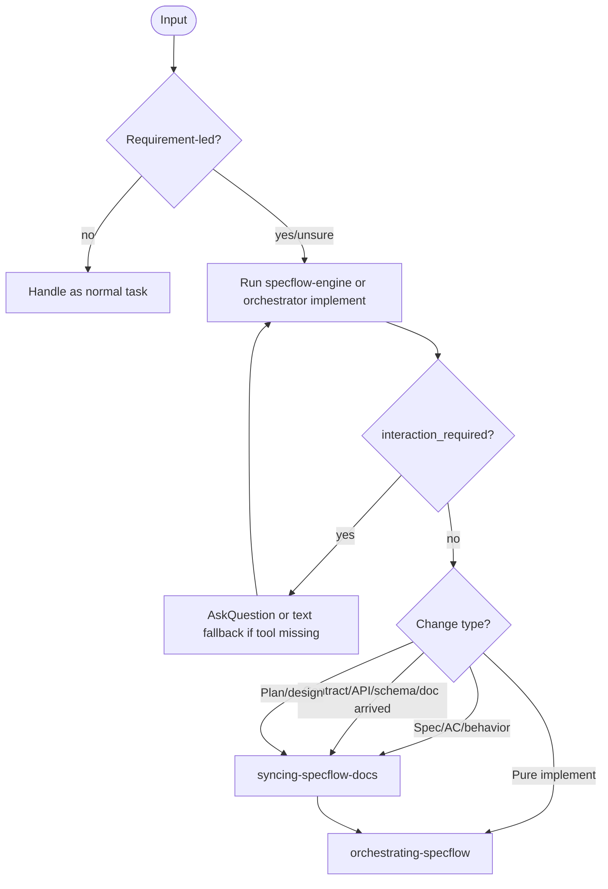

# Using SpecFlow：会话总闸

把每一轮对话先落到需求与阶段上，再决定是否推进引擎、同步文档或派发子代理，避免把需求变更当成实现推进。

## Cursor 会话注入

若工作区启用 Cursor Hooks：`hooks/hooks.json` 的 `sessionStart` 会运行 `hooks/specflow-session-start.sh`，把本文件全文注入为 `additional_context`。本文件是会话总闸的单一事实来源。

## 设计思想

| 原则 | 含义 |
| --- | --- |
| Default On | 只要有 1% 可能是需求驱动，就先按 SpecFlow 处理。 |
| Engine First | 未运行 orchestrator/engine 前，不派发子代理、不改生产代码、不手写需求文档。 |
| Change Before Implement | 规格、验收、合约、接口、方案变化先同步文档，再实现。 |
| Token Efficient | 默认不读脚本源码，优先执行稳定脚本并消费结构化输出。 |

## 使用时机

满足任一即可启用：

- 新功能、产品行为、交互策略、评审结论、验收标准、发版范围。
- PRD 式内容：需求号、模块名、列表/表单/筛选项、接口路径、字段名、DTO、查询参数。
- 飞书 / Lark / Wiki / PRD 链接，且语境是落地、开发、实现、改字段/接口/表单/筛选项。
- 涉及 `ai-docs/`、specify、plan、Roadmap、QA、归档。
- 用户说实现、改接口、改字段、同步规格、继续、QA、归档等。

不启用：

- 纯技术问答。
- 与需求无关的本地环境/工具排错。
- 无交付语境的代码解释或排版。

## 终态

- 本轮被正确分类为 implement、change、interaction、block、anchor 或非 SpecFlow。
- 若进入 SpecFlow，已经运行引擎并依据 `suggestedAction` 进入下一技能。
- 若是需求变更，先进入 `syncing-specflow-docs`，再回编排。

<HARD-GATE>

不得在未运行 orchestrator/engine 前派发子代理、改生产代码或同步需求文档。
不得把后到接口文档、OpenAPI、字段表、错误码当成纯实现细节。
不得在未同步文档的情况下改合约、接口或外部行为。
Clarification Log 中未闭合的 `[?]` 必须闭合后方可进入 Plan。
引擎返回 `interaction_required` 时，有 AskQuestion 工具必须先调用；不得只用自然语言复述选项。

</HARD-GATE>

## 执行真相源

- `orchestrating-specflow`
- `syncing-specflow-docs`
- `specflow`
- `docs/implement-vs-change.md`
- `docs/user-facing/VOICE.md`
- `tools/README.md`

## 流程

## Change vs Implement

| 场景 | 下一步 |
| --- | --- |
| 显式开启交付主线 | `specflow` → `orchestrating-specflow` |
| 改 AC / 外部行为 / 接口 / 方案 | `syncing-specflow-docs` → `orchestrating-specflow` |
| 继续实现 / 验收 / 归档 | `orchestrating-specflow` |
| 不确定是否相关或是否变更 | 先按 `docs/implement-vs-change.md` 判定 |

## Token 约束

- 默认不读取脚本源码，优先执行 `orchestrator.cjs` / `specflow-engine.cjs` 并消费结构化输出。
- 仅在参数契约未知、命令报错排障、用户要求核对规则变更时读取脚本源码。
- 必要读取时采用最小范围读取，避免重复读取同一大脚本。

## 反模式

- “小字段不用 sync-document。”
- “先改代码，文档之后再补。”
- “用户没说 SpecFlow，所以直接实现。”
- “PRD/接口说明看起来很明确，不用跑 orchestrator。”
- “飞书需求链接直接当普通开发任务处理。”

## 自检

- 这轮是否有任何需求驱动迹象？
- 是否先跑了引擎？
- 是否正确区分了 implement 与 change？
- 若有 `interaction_required`，是否使用 AskQuestion 或等价输入？
- 是否没有绕过文档同步直接改合约/接口？

## 输出契约

- SpecFlow 相关：转入 `orchestrating-specflow`、`syncing-specflow-docs` 或 `specflow`。
- 非 SpecFlow：按普通任务处理。
- 用户可见话术遵循 `docs/user-facing/VOICE.md`，避免暴露内部字段和脚本机制。
