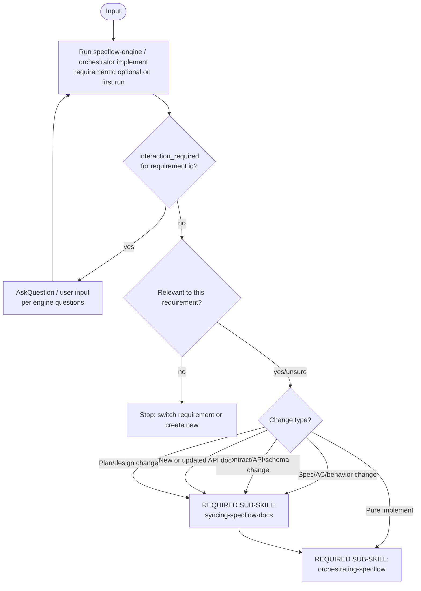

# 使用 Specflow（总闸）

## Cursor 会话注入（可选）

若工作区启用 **Cursor Hooks**：`hooks/hooks.json` 的 **`sessionStart`** 会运行 `hooks/specflow-session-start.sh`，把**本文件（`skills/using-specflow/SKILL.md`）全文**注入为 `additional_context`。**单一事实来源**：无需另建 `specflow-session-context.md`。

## Overview

把每一轮对话先“落到需求与阶段”上，再决定是否推进引擎/派发子代理，避免把**需求变更**当成**实现推进**。

### 触发阈值

**只要存在一丝可能**本轮属于「需求开发」或「需求变更」（含用户只贴了需求描述、需求号、页面改动、筛选项、接口字段、POST/GET 参数、与交付相关的任何产品行为），**就必须按本技能处理**：**先跑引擎**，再谈改代码或手写规格。**禁止**因为用户没写「Specflow」「先 specify」或消息长得像「直接开发」就默认进入纯实现路径。

**典型误判（一律仍先跑引擎）**：消息里同时出现 **需求编号 + 交互说明 + 接口字段**（或纯 PRD 式罗列）——这是**需求驱动交付**，不是「可跳过编排的内部小改」。

**需求号**：**不要求**用户在第一句话就给出。可先运行 **`specflow-engine.cjs [workspaceRoot]`**（无需求号），或已知需求号时用 **`orchestrator.cjs implement`**；由引擎 **`interaction_required`**（如 `init_requirement_id` / `init_requirement_text`）引导选号/输入，**不要**在未跑引擎前自行编造文档或派发实现。

**入口意图（先分再跑）**：凡属**需求变动**，先在脑中二选一——**(A) 业务/验收/口径** 还是 **(B) 合约与技术事实**（含 **后到的接口文档、OpenAPI、字段表、错误码**）。两者都可能改 `specify`/`plan`；(B) **优先**视为 **合约变更**：走 **`syncing-specflow-docs` / `orchestrator change`**（通常 `--target plan` 或 `both`），再 `implement`；**不要**把「补接口文档」当成纯实现细节而直接改代码。

**Core principle：** 先跑引擎再行动；先同步文档再改代码。

**Violating the letter of this process is violating the spirit of this process.**

---

## The Iron Law

```
推进 Specflow 的任一轮中：
先运行 orchestrator/engine 并依据 suggestedAction 决策。

STRICTLY PROHIBITED：未运行 `orchestrator.cjs` 就派发子代理/改生产代码/同步需求文档。
```

---

## When to Use（行为 / 意图，非关键词）

**应启用（满足任一即可）：**

- 本轮在谈**交付**：新功能、改产品行为、交互/策略、评审结论、验收标准、里程碑、发版范围。
- 用户粘贴 **需求文档式内容**：含 **需求号/模块名** + **前端列表/表单/筛选项** + **接口路径或字段名**（如 `contentScoreTag`、`externalName`、`POST …/save`）——**一律视为需求驱动**，必须先 `orchestrator`/`specflow-engine`，**禁止**默认「定位仓库直接改代码」。
- **飞书 / Lark / 需求 Wiki / PRD 链接**（`feishu.cn`、`larksuite.com` 等）且语境是**落地、开发、实现、改字段/接口/表单/筛选项**——**一律视为需求驱动交付**，必须先 `orchestrator`/`specflow-engine`，**禁止**当成「直接写代码」而跳过；用户未说「specflow」也要走。
- 涉及 **`ai-docs/`**（含 specify/plan、需求号目录、Roadmap、QA、归档）或用户**即将/正在**改与需求合约相关的代码。
- 用户说「实现 / 改接口 / 改字段 / 同步规格 / 继续 / QA / 归档」等——**即使未出现「specflow」**也按本技能处理。

**不启用：**

- 纯技术问答、与需求无关的重构/排版、无交付语境的代码解释。
- 仅本地环境/工具排错且与产品行为、`ai-docs` 无关。

---

## 执行协议（决策流）



**详细判定规则与示例**：`docs/implement-vs-change.md`。

---

## Constraints

- **MUST** 在需要绑定需求时具备目标 `requirementId`：**优先**由引擎 `interaction_required`（`init_requirement_id` / `init_requirement_text` 等）或用户声明提供；**首轮允许尚无需求号**，但**不许**跳过引擎、徒手创建 `ai-docs` 目录或派发实现
- **MUST** 当引擎返回 `interaction_required`（含 **进入 Plan** 的 `confirm_start_plan`、Group 的 `confirm_start_group`、归档、澄清 `CQ-*`、熔断等）：在 Cursor 中 **先调用 `AskQuestion` 工具** 使用 `suggestedAction.questions`，**禁止**仅用自然语言复述选项而不调工具（无该工具的环境除外）。
- **MUST** `dispatch` 时：先 `print-protocol.cjs`，再显式派发子代理
- **MUST（Token Efficiency）** 默认**不读取脚本源码**；优先直接执行稳定脚本入口（如 `orchestrator.cjs` / `specflow-engine.cjs`）并消费结构化输出
- **MUST（Token Efficiency）** 仅在以下场景允许读脚本源码：首次接入且参数契约未知；命令报错需排障；用户明确指出规则/契约已变更且要求核对行为
- **MUST（Token Efficiency）** 必要读取时采用最小范围读取（targeted ranges），禁止默认整文件读取大脚本；同一任务中避免重复读取同一脚本
- **STRICTLY PROHIBITED** Implement 阶段在未 `sync-document` 的情况下改合约/接口/外部行为（先 `syncing-specflow-docs`）
- **STRICTLY PROHIBITED** 跳过**阻塞性**澄清闭环：Clarification Log 中未闭合的阻塞性 `[?]` 必须闭合后方可进入 Plan（无阻塞性 `[?]` 时无需提问）

---

## Red Flags — 出现以下念头时立即停止

- “这只是个小字段，不用 sync-document”
- “我先改代码更快，文档之后再补”
- “用户只是问问，不算变更请求”
- “我不跑 orchestrator 也能判断下一步”
- “用户贴了飞书需求链接，我按常规直接实现就行”
- “没写 specflow/specify/需求号，就可以先改代码”
- “消息像 PRD/接口说明，但没说走 Specflow，我就直接实现”

**以上所有念头都意味着：停止，先回到引擎/编排状态检查。**

---

## Common Rationalizations

| Excuse                                        | Reality                                                     |
| --------------------------------------------- | ----------------------------------------------------------- |
| “小改动不需要同步文档”                        | 小改动也会让 plan/spec 与代码脱节，后续会读到过期信息       |
| “先写实现，再补 spec/plan”                    | Implement 的门禁就是为了阻止漂移；先同步再实现更快更稳      |
| “用户贴的是 PRD/接口说明，我按惯例直接改代码” | 仍是需求驱动；必须先引擎再行动，由 `suggestedAction` 定阶段 |
| “我知道该派发哪个 agent”                      | 真相源在 `suggestedAction`；跳过脚本会破坏锚点与闭环        |

---

## Quick Reference

| 场景                             | 操作                                               |
| -------------------------------- | -------------------------------------------------- |
| 显式开启交付主线（implement 链） | `specflow` → `orchestrating-specflow`              |
| 变更任何 AC/外部行为/接口/方案   | `syncing-specflow-docs` → `orchestrating-specflow` |
| 继续实现/验收/归档               | `orchestrating-specflow`                           |
| 不确定是否相关/是否变更          | 先按 `implement-vs-change` 判定，再行动            |

---

## 索引

- **用户可见话术（单一事实来源）**：`docs/user-facing/VOICE.md`（自然语言、禁用内部名词；改交互文案先改此文件原则）
- **编排闭环**：`orchestrating-specflow`
- **交付主线显式入口**：`specflow`（可执行资产位于插件根 `tools/`、`protocols/`、`templates/`、`docs/`）
- **需求变更同步**：`syncing-specflow-docs`
- **完整协议**：`docs/orchestration-full.md`
- **脚本用法**：`tools/README.md`
